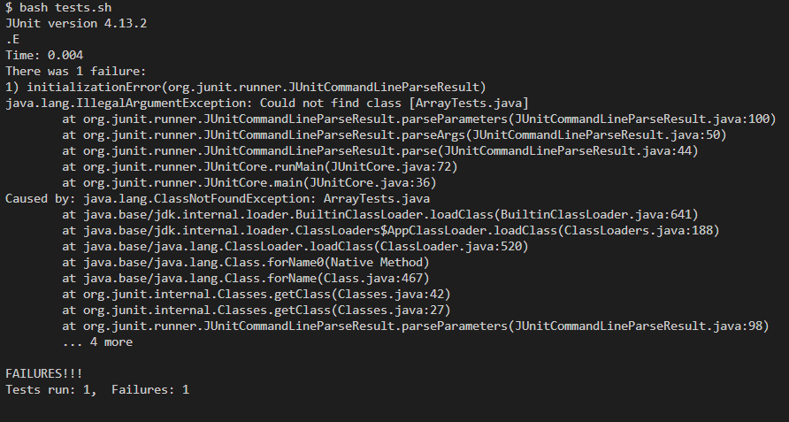
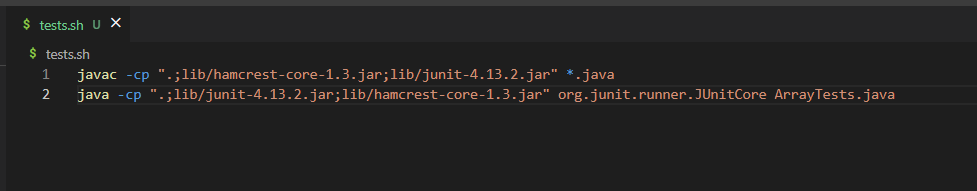
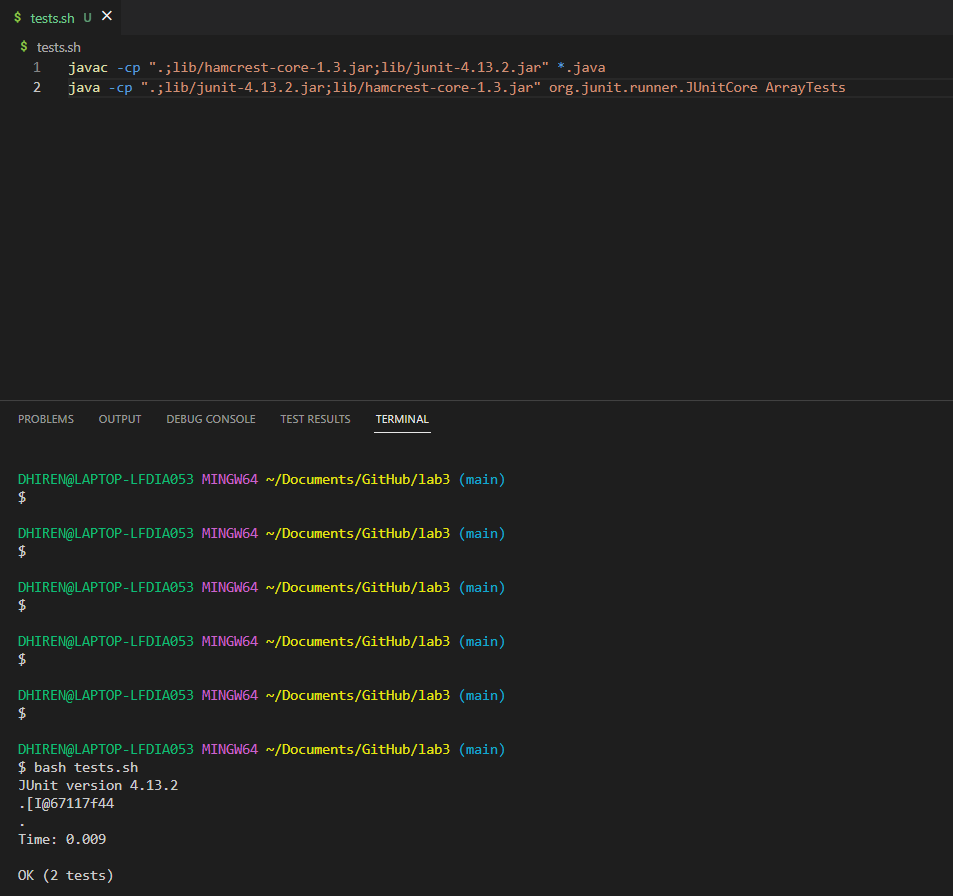
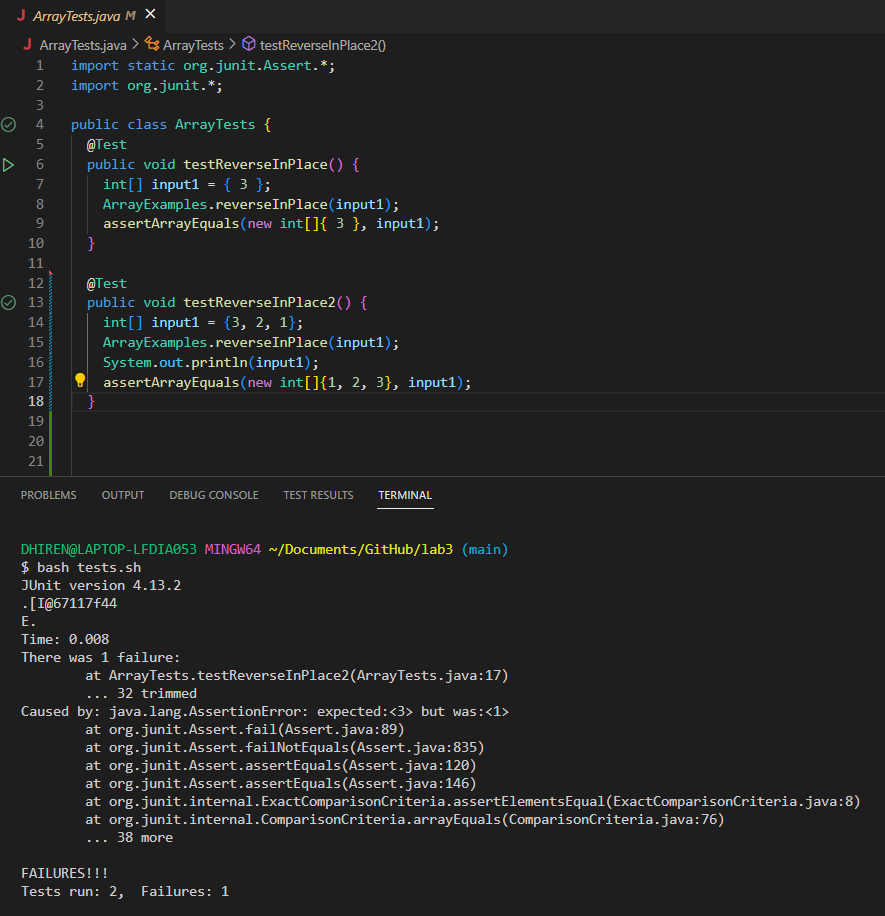
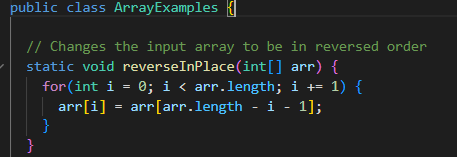
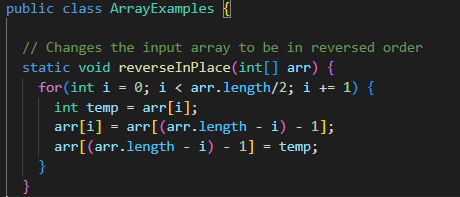

# Lab Report 5
---
## Pt. 1

For this lab, we are looking at a student that is seemingly having some trouble with their code in some different areas. I had also seen in the EdStem submission that the student had utilized some of the code from the third lab to try something that may cause their time to decrease when trying different tests.

The first issue that I had ran to was when I was utilizing the `tests.sh` file, as that was one of the issues that was present as i had seen

From the error message that was being presented there was seemingly a problem with the `.sh` file that the student had created it. The first thing that I should do is look at the code and see if there is any obvious issues that could be fixed

With looking at the code and the errror message, the issue seemingly is that the JUnit can't find and call on the file, as the file name was wrong inside of the `.sh`. After doing the `javac` command and then doing `java`, you only need the file name without the .java.

After trying those changes, it seems that the `.sh` file seems to be able to  work now

From the submission, there had seemed to be another issue that had needed some debugging, as they had tried another way to write one of the methods that ended up giving an error.

One again, I had looked at the method they had implemented in the first place to see what was the problem.

With this, I could definitely see that there is a problem with how it works. If you iterate over the entire array, you aren't able to keep the original number, making it almost impossible for you to do the reversal correctly. After some changes such as iterating over only half (as the other half will be changed in conjunction with the first half) and adding a temporary variable to keep the original number somewhere when reversing the array, it should look something like this.

